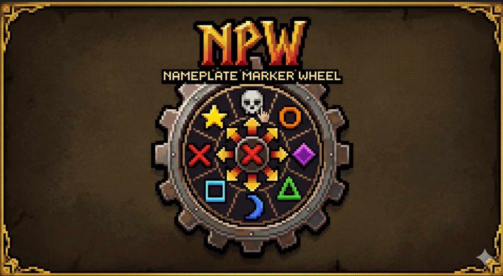

# NamePlateMarkerWheel

<p align="center">
  
</p>

[English](README_EN.md) | 简体中文

魔兽世界快速标记插件 - 通过双击或 Alt+点击姓名板，弹出径向轮盘快速设置团队标记。


## 功能特性

- 🎯 **双击唤出** - 快速双击任意姓名板即可唤出标记轮盘
- ⌨️ **Alt+点击唤出** - 按住 Alt 键并点击姓名板也能唤出
- ⚔️ **战斗快捷标记** - 无需唤出轮盘，直接使用修饰键+点击设置任意标记（战斗中可用）
- 🔥 **8种团队标记** - 径向排列的 8 个标记按钮（星星、大饼、菱形、三角、月亮、方块、叉叉、骷髅）
- ❌ **中心清除按钮** - 一键移除目标标记
- ⌨️ **ESC键关闭** - 按 ESC 键或点击外部快速关闭轮盘
- 🔄 **标记同步高亮** - 轮盘会高亮显示目标当前已有的标记
- ⚙️ **图形化配置** - `/npw config` 打开配置界面，实时预览设置效果
- 🎨 **圆形轮盘** - 支持圆形/矩形多种材质样式
- 🎭 **材质配置** - 纯色、暴雪风格、工具提示、自定义纹理
- ✨ **动画效果** - 可配置的打开/关闭缩放动画

## 安装方法

### 方式一：下载即用（推荐）

1. 从 [Releases](../../releases) 下载最新版本的 `NamePlateMarkerWheel.zip`
2. 解压后将 `NamePlateMarkerWheel` 文件夹复制到：
   ```
   World of Warcraft\_retail_\Interface\AddOns\
   ```
3. 重启游戏或在角色选择界面启用插件

### 方式二：手动安装

如果你下载的是源代码，只需要 `src` 文件夹中的文件：

1. 在 `Interface\AddOns\` 下创建 `NamePlateMarkerWheel` 文件夹
2. 将 `src` 文件夹中的所有文件复制进去：
   ```
   Interface\AddOns\NamePlateMarkerWheel\
   ├── NamePlateMarkerWheel.toc
   ├── Core.lua
   ├── Utils.lua
   ├── Config.lua
   ├── Register.lua
   ├── Events.lua
   └── WheelUI.lua
   ```
3. 重启游戏

## 使用方法

### 快速标记

| 操作 | 效果 |
|------|------|
| **双击姓名板** | 唤出标记轮盘 |
| **Alt + 左键点击** | 唤出标记轮盘（备选方式）|
| **点击标记图标** | 为目标设置对应标记 |
| **点击中心按钮** | 清除目标标记 |
| **ESC 键** | 关闭轮盘 |

### 战斗快捷标记（无需唤出轮盘）

在配置面板中（`/npw config` → 战斗快捷标记），你可以为每个标记设置独立的按键组合：

| 按键组合 | 默认绑定 |
|---------|---------|
| **Alt + 左键** | 星星 (1) |
| **Ctrl + 左键** | 大饼 (2) |
| **Shift + 左键** | 菱形 (3) |
| **Alt + 右键** | 三角 (4) |
| **Ctrl + 右键** | 月亮 (5) |
| **Shift + 右键** | 方块 (6) |
| **Alt + Ctrl + 左键** | 叉 (7) |
| **Alt + Shift + 左键** | 骷髅 (8) |
| **Alt + 中键** | 清除标记 |

**特点：**
- ✅ **战斗中可用** - 使用 `SetOverrideBindingClick` 技术，安全按钮预创建
- ✅ **可自定义** - 在配置面板自由设置每个标记的修饰键和按键
- ✅ **即时生效** - 修改配置后立即应用，无需重载界面
- ✅ **随时开关** - 可单独启用/禁用此功能

**修饰键选项：** 无、Alt、Ctrl、Shift、Alt+Ctrl、Alt+Shift、Ctrl+Shift、Alt+Ctrl+Shift

**按键选项：** 左键、右键、中键

### 命令列表

输入 `/npw` 或 `/nameplatemarkerwheel` 查看所有命令：

```
/npw test         - 在屏幕中央显示测试轮盘
/npw tar          - 对当前目标显示轮盘
/npw config       - 打开图形化配置界面
/npw debug        - 切换调试模式
/npw reset        - 重置配置
/npw status       - 查看插件状态
/npw forcereset   - 完全重置（需重载界面）
```

## 兼容性

- **游戏版本**: World of Warcraft 12.0+ (至暗之夜 / The War Within)
- **插件冲突**: 与主流姓名板插件（Plater、Threat Plates 等）兼容

## 常见问题

**Q: 双击没有反应？**
A: 请确保两次点击间隔在 0.5 秒内，且点击的是同一目标。

**Q: 战斗中可以用吗？**
A: 可以，插件使用安全按钮技术，战斗中也能正常标记。

**Q: 如何关闭轮盘？**
A: 按 ESC 键，或点击轮盘外部区域。

**Q: 战斗快捷标记和轮盘会冲突吗？**
A: 不会。战斗快捷标记只在轮盘**未显示**时生效。如果轮盘已打开，点击会操作轮盘上的按钮。

**Q: 如何关闭战斗快捷标记？**
A: 输入 `/npw config` 打开配置面板，取消勾选"启用战斗快捷标记"即可。

**Q: 战斗快捷标记和其他插件按键冲突怎么办？**
A: 在配置面板中为冲突的标记选择其他修饰键组合。建议使用较少使用的组合（如 Alt+Ctrl+左键）。

**Q: 修改战斗快捷标记配置后需要重载吗？**
A: 不需要，修改后立即生效。但如果在战斗中修改，需要等战斗结束后才能更新绑定。

## 更新日志

### v1.2.0 (2026-03-11)

- ⚔️ **新增战斗快捷标记** - 无需唤出轮盘，直接使用修饰键+点击设置标记
- ⚔️ 支持 8 种修饰键组合（Alt、Ctrl、Shift 及其组合）
- ⚔️ 战斗中完全可用（使用 `SetOverrideBindingClick` 安全绑定）
- ⚔️ 图形化配置界面，为每个标记独立设置按键组合
- ⚔️ 即时生效，修改后立即应用无需重载
- ⚔️ 可随时启用/禁用，不影响轮盘功能

### v1.1.0 (2026-02-19)

- 🎨 新增圆形轮盘背景（使用遮罩技术）
- 🎨 新增边框效果，增强视觉轮廓
- 🎨 支持 8 种材质样式（圆形/矩形 × 纯色/暴雪/工具提示/自定义）
- 🎨 背景不透明度独立配置
- 🎨 中心按钮风格统一（与其他标记按钮一致）
- ⚡ 优化配置界面，支持实时预览

### v1.0.0 (2026-02-19)

- ✨ 初始版本发布
- ✨ 支持双击和 Alt+点击两种触发方式
- ✨ 8种团队标记快速设置
- ✨ 标记同步高亮显示
- ✨ 战斗中完全可用
- ✨ 图形化配置界面（`/npw config`）
- ✨ 可配置的轮盘外观和行为设置
- ✨ 打开/关闭动画效果

## 许可证

MIT License - 自由使用，欢迎分享

---

**提示**: 这是一个开源的魔兽世界插件，仅供学习交流使用。
